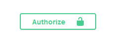

# Usage
## Swagger configuration
Information about the swagger setup itself ([OpenAPI object](https://swagger.io/specification/?sbsearch=external-docs#openapi-object) and [Info](https://swagger.io/specification/?sbsearch=external-docs#info-object)) can be configured
through the Grails runtime configuration files (e.g `/grails-app/conf/application.yml`).

Below is an example of a configuration. Note that the entire OpenAPI spec if not yet implemented.
```yaml
swagger:
    # openapi: '3.1.1' # Should rarely be used! Uses default value from OpenAPI class if not provided.
    # paths: # Not implemented, as it is buildt automatically from swagger annotations
    # webhooks: # Not yet implemented
    # tags: # Not implemented, also built from swagger annotations
    servers:
        - url: https://development.gigantic-server.com/v1
          description: Development server
        - url: https://staging.gigantic-server.com/v1
          description: Staging server
    components:
        securitySchemes: # This is the only component that is currently configureable directly from config files (the rest are built from annotations)
            BearerToken:
              type: "apiKey",
              name: "my apiKey",
              description: "A Bearer token for authentication",
              in: "header",
              bearerFormat: "JWT"
    security:
        - "BearerToken"
    externalDocs:
        description: Find more info here
        url: https://example.com
    info:
        title: Sample Pet Store App
        summary: A pet store manager.
        description: This is a sample server for a pet store.
        termsOfService: https://example.com/terms/
        contact:
            name: API Support
            url: https://www.example.com/support
            email: support@example.com
        license:
            name: Apache 2.0
            url: https://www.apache.org/licenses/LICENSE-2.0.html
        version: 1.0.1
```
### Security configuration
The following guide does a great job of explaining how to configure security: https://swagger.io/docs/specification/authentication/

This enables you to add authentication functionality to the Swagger UI, so that users can make REST requests to secure endpoints directly from Swagger.
For example, the above YAML configuration renders an _Authorize_ button which opens a modal where users can paste their token, which is automatically added to any REST request headers.



## Controller annotation

A controller will only be included in swagger if it is annotated with `@Tag()`. Use property `name` to control the Swagger controller title.
```groovy
@Tag(name = 'MyController', description = 'An example controller')
class MyController {
}
```

## Action/method annotation

For an action (method) in a controller to be included in swagger, it must be annotated with `@Operation()`.

### Action with request body

```groovy
@Operation(
    summary = 'An example controller',
    description = 'This controller is used to illustrate actions that take a json body as input.',
    requestBody = @RequestBody(
        content = [
            @Content(
                schema = @Schema(implementation = TestInputBody)
            )
        ]
    ),
)
def actionWithBody() {
    render(text: "All OK", status: HttpStatus.OK)
}
```

The class of the request body, `TestInputBody` can be further documented using `@Schema()` annotations both on class level and property level:

```groovy
@Schema(description = 'description on class level', title='title on class level')
class TestInputBody {

    @Schema(minLength = 1, maxLength = 40, description = 'a persons name')
    String name
    Boolean isWicked
    List<TestInputSubBody> subs = []
}

class TestInputSubBody {
    String name

    @Schema(defaultValue = '10', maximum = '100', example = "22")
    int age = 10
}
```

### Action with Command object

Input parameters of a class, which name ends in 'Command' will automatically be parsed as command objects as long as there is a matching `@Parameter` annotation
on the method, where the `name` property matches with the command parameter. The parameters of the command object will be handled as separate input parameters in the Swagger documentation, of the type that is specified with the `in` property.

```groovy
@Operation(parameters = [
    @Parameter(name = 'cmd', in = ParameterIn.PATH)
])
def methodWithCommandObject(TestCommand cmd) {
    render(text: cmd.validate())
}
```

To add more documentation to the individual properties/parameters of the Command-object, use `@Property()` annotations (together with `@Schema()` annotation for more constraints), like so:

```groovy
class TestCommand implements Validateable {

    @Parameter(schema = @Schema(examples = ['a', 'ab', 'abc']))
    String a
    @Parameter(description = 'Some ints', schema = @Schema(minLength = 1))
    List<Integer> ints
    @Parameter(required = true, example = 'my string',schema = @Schema(minLength = 1, maxLength = 100))
    String name
    
    static constraints = {
        a nullable: false, maxSize: 5
        ints nullable: false, minSize: 1
    }
}
```

## Responses

```groovy
Operation(
    responses = [
        @ApiResponse(responseCode = '200', description = 'All went OK', content = [
            @Content(mediaType = MediaType.APPLICATION_JSON_VALUE, schema = @Schema(implementation = MyResponseClass))
        ]),
        @ApiResponse(responseCode = '400', description = 'Some validation error occured. Returns a list of said validation errors.', content = [
            @Content(mediaType = MediaType.APPLICATION_JSON_VALUE, array = @ArraySchema(items = @Schema(implementation = MyValidationError)))
        ])
    ]
)
def action() {
    render(text: "All OK", status: HttpStatus.OK)
}
```


